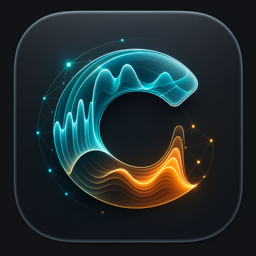
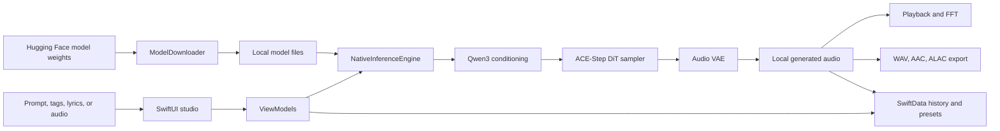

<p align="center">
  
</p>

# Cantis

**An on-device music studio for Apple Silicon Macs, maintained by Team AER.** Cantis turns text prompts, lyrics, tags, and reference audio into music using ACE-Step v1.5. Its SwiftUI interface and native Swift inference engine run in one process, accelerated by MLX and Metal.

[Product overview](https://aer.app/cantis/) · [Mac App Store](https://apps.apple.com/in/app/cantis/id6764599986?mt=12) · [User guide](docs/USER_GUIDE.md) · [Development](docs/DEVELOPMENT.md) · [Issues](https://github.com/Team-AER/Cantis/issues)

Model weights download from Hugging Face during setup or when you add models. Once those files are present, generation runs locally: prompts, lyrics, and source audio do not need a cloud generation service. See the [privacy policy](PRIVACY.md) for network and local-data details.

## Studio features

- **Prompt, tags, and lyrics:** describe a style, choose genre/instrument/mood tags, and write structured lyrics with a language hint.
- **Four generation modes:** text-to-music, cover, repaint, and extract. Cover uses source and reference audio; repaint uses source audio and a time-range mask; extract uses reference audio.
- **Creative controls:** duration, seed, sampling steps, schedule shift, and CFG scale on SFT/Base models. Turbo defaults to eight steps; SFT and Base default to 60.
- **Listen and inspect:** playback, waveform visualization, and a live FFT spectrum analyzer.
- **Keep your work:** searchable history, favorites, saved presets, and a reusable tag library.
- **Export audio:** WAV, AAC, and ALAC (`.m4a` for the latter two). MP3 and FLAC are excluded from the supported-format picker.
- **Manage models:** in-app downloads for Turbo, SFT, and Base; compatible custom Hugging Face model repositories; low-memory settings and a built-in log viewer.

The landing page introduces this same studio workflow. This repository is the reference for implemented modes, supported formats, and current build requirements. LM-hint generation (`text2musicLM`) is not implemented; XL variants are conversion tooling targets and are not offered in the standard model picker. Extract mode is not a promise of a separate multi-stem export workflow. Generation speed depends on hardware, model, duration, and settings.

## How it works



The engine, player, and persistence live in the same macOS app. Python is optional developer tooling for weight conversion, never a runtime backend. See [architecture](docs/ARCHITECTURE.md) for model storage, state transitions, and concurrency.

## Requirements

| Requirement | Current source build |
| --- | --- |
| Operating system | macOS 26 or later |
| Hardware | Apple Silicon (M1 or later) |
| Memory | 16 GB unified memory recommended; smaller Macs may swap or run out of memory |
| Storage | About 6.6 GB for Turbo model files, plus download headroom and generated audio; SFT/Base add about 4.8 GB each |
| Toolchain | Xcode 26 with Swift 6.2 and the macOS 26 SDK |
| Network | Initial model download and any later model additions/redownloads |

Storage figures are approximate manifest estimates, not guaranteed download sizes. Sandboxed app storage lives in its macOS container; terminal builds use the user Application Support directory.

## Build and make your first track

```bash
git clone https://github.com/Team-AER/Cantis.git
cd Cantis
swift run Cantis
```

Alternatively, open `Package.swift` in Xcode and run the `Cantis` executable target. `Cantis.xcodeproj` is also included for app-bundle, signing, and distribution work.

1. Complete onboarding and download the Turbo model.
2. Choose Text → Music, enter a prompt and tags, and optionally add lyrics.
3. Generate, listen in the player, and export or favorite the result.

For audio modes, model switching, local storage, and troubleshooting, see the [user guide](docs/USER_GUIDE.md). Offline conversion instructions are in the [development guide](docs/DEVELOPMENT.md).

## Checks

```bash
swift build
swift test --skip 'ACEStepDiTTests|ACEStepLMTests|FeasibilityProbeTests|Qwen3ConditioningTests|Qwen3RealWeightsTests'
python3 -m py_compile modeling_acestep_v15_turbo.py tools/convert_weights.py
```

The commands match CI. Full `swift test` includes MLX integration suites requiring a local Metal runtime and, for real-weight tests, model files; run those from Xcode when changing inference.

## Repository and documentation

| Path | Purpose |
| --- | --- |
| `Cantis/Views/`, `ViewModels/`, `Components/` | SwiftUI studio and state |
| `Cantis/Inference/` | Native ACE-Step, text encoder, audio VAE, and LM components |
| `Cantis/Services/`, `Models/`, `Utilities/` | Audio, downloads, persistence, configuration |
| `CantisTests/` | Unit and MLX integration tests |
| `tools/convert_weights.py` | Offline weight converter |
| `Package.swift`, `Cantis.xcodeproj/` | Package build and bundled-app project |

- [User guide](docs/USER_GUIDE.md)
- [Architecture](docs/ARCHITECTURE.md)
- [Development guide](docs/DEVELOPMENT.md)
- [Pending plan](docs/PENDING_PLAN.md) and [release checklist](docs/RELEASE_CHECKLIST.md)
- [Contributing](CONTRIBUTING.md), [support](SUPPORT.md), [security](SECURITY.md), and [code of conduct](CODE_OF_CONDUCT.md)
- [Privacy](PRIVACY.md)

## Acknowledgements and license

Cantis builds on the music-generation work of [ACE-Step](https://github.com/ace-step/ACE-Step-1.5) and the on-device capabilities of [mlx-swift](https://github.com/ml-explore/mlx-swift). Thanks to those upstream contributors and the maintainers of [Swift Collections](https://github.com/apple/swift-collections) and [SwiftUI-Shimmer](https://github.com/markiv/SwiftUI-Shimmer).

The application is distributed under the [MIT License](LICENSE). Model checkpoints and third-party components retain their own licenses; check the corresponding model repository before using or redistributing weights.
